# حرب الممالك: الليل الطويل قادم
### خريطة وستيروس كاملة لماينكرافت Java، بحملة تعاونية عربية

ماينكرافت **Java Edition** (مبنية لآخر إصدار **26.3**، وتعمل غالبًا على 1.21.x). كل نصوص اللعبة بالعربي.

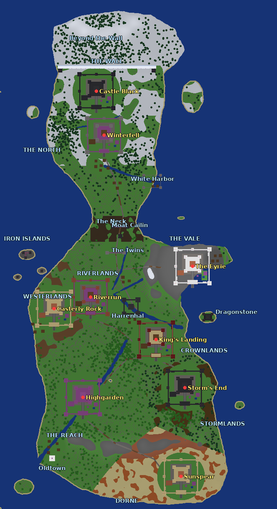

## الفكرة
الجيش الميت يزحف من الشمال ويهاجم القلاع **واحدة تلو الأخرى**. أنتم (أنت وربعك) تختارون بيتًا وتتوزعون على القلاع، وتدافعون عنها قبل أن تسقط.
* **الغراب ينذركم** قبل كل هجوم بدقيقتين (رسالة وعنوان على الشاشة).
* القلعة التي **تصمد** تمدّكم بـ**حلفاء** في المعركة الأخيرة، والقلعة التي **تسقط** تجعل الأعداء أقوى.
* في النهاية تجتمعون في **وينترفيل** لمواجهة **ملك الليل**.
* **الشتاء يزحف**: كلما مرّ الوقت يزداد البرد، وفي الشمال بلا نار أو قلعة يعضّك الصقيع.

## صور من منظور اللاعب
> ⚠️ هذي **رسومات من مجسّم بسيط سوّيته أنا** يقرأ ملفات العالم، وليست لقطات حقيقية من ماينكرافت. الشكل الحقيقي داخل اللعبة يختلف
> (خصوصًا مع الأنسجة والإضاءة والـ shaders).

| | |
|---|---|
| 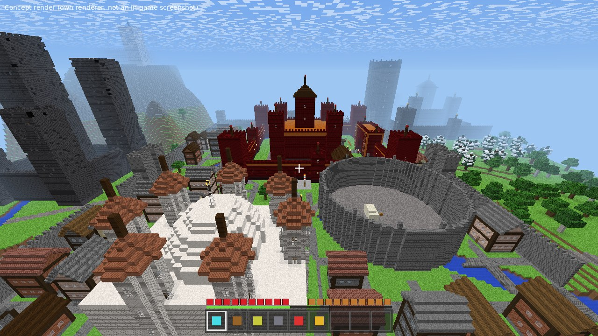 كينغز لاندينغ: مدينة بسور وشوارع وأنهار | 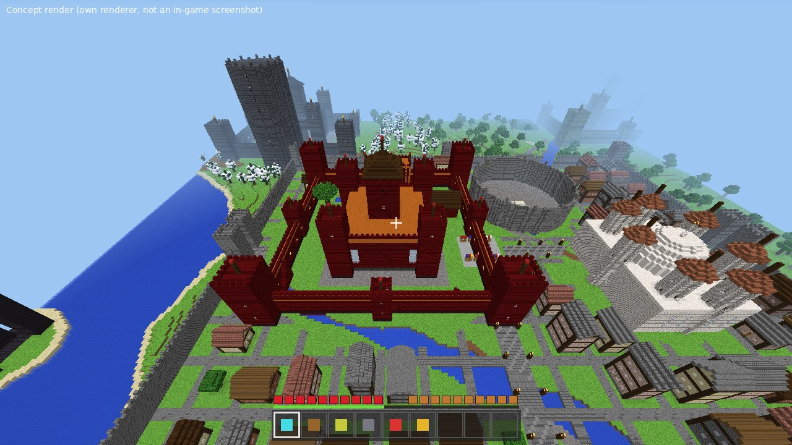 القلعة الحمراء وحلبة التنانين |
| 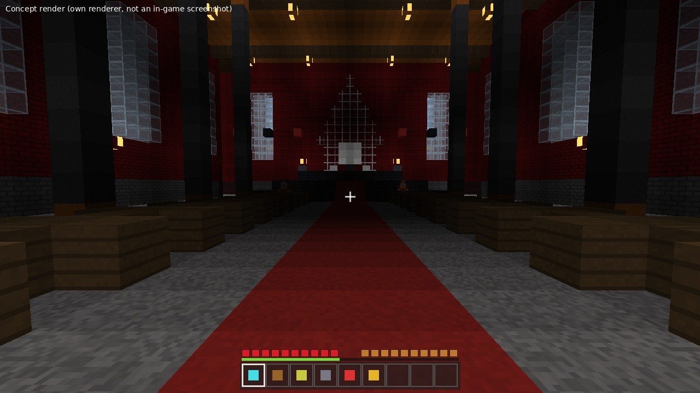 قاعة العرش | 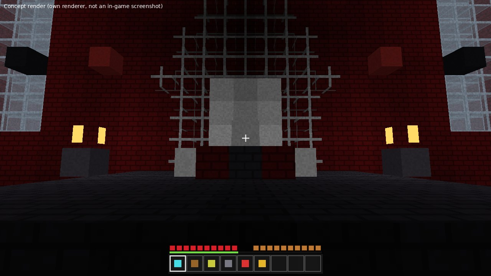 العرش الحديدي |
| 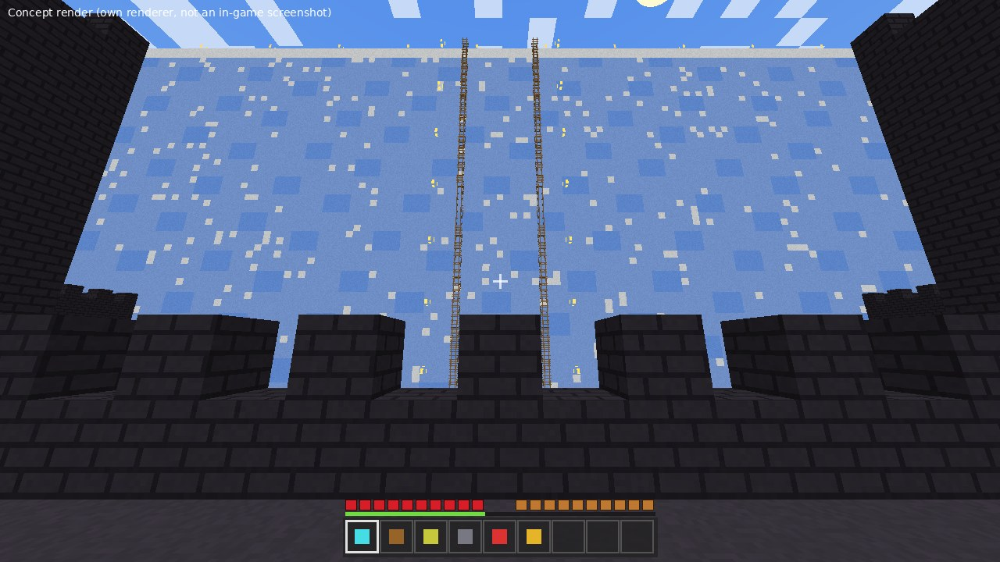 الجدار من القلعة السوداء | 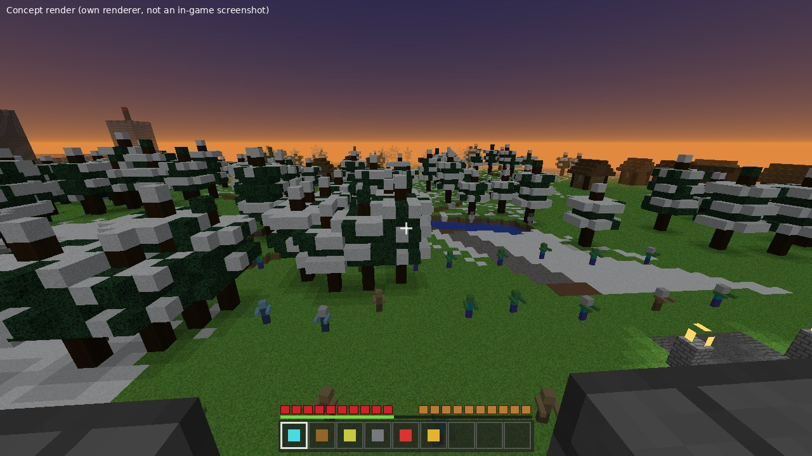 معركة عند الغروب |
| 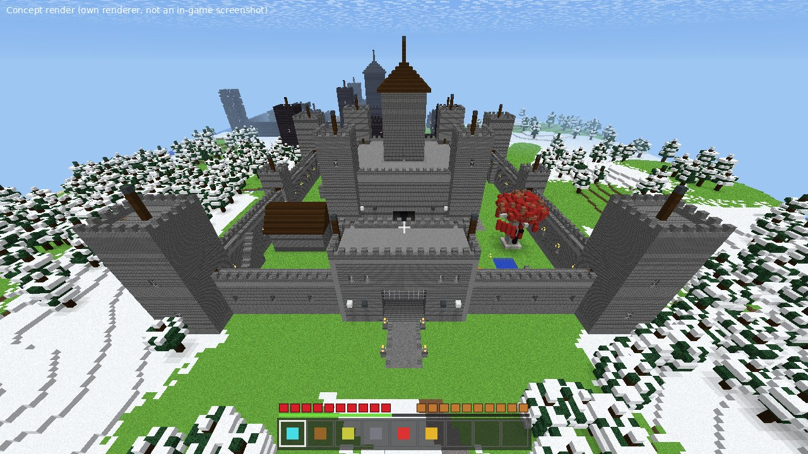 وينترفيل | 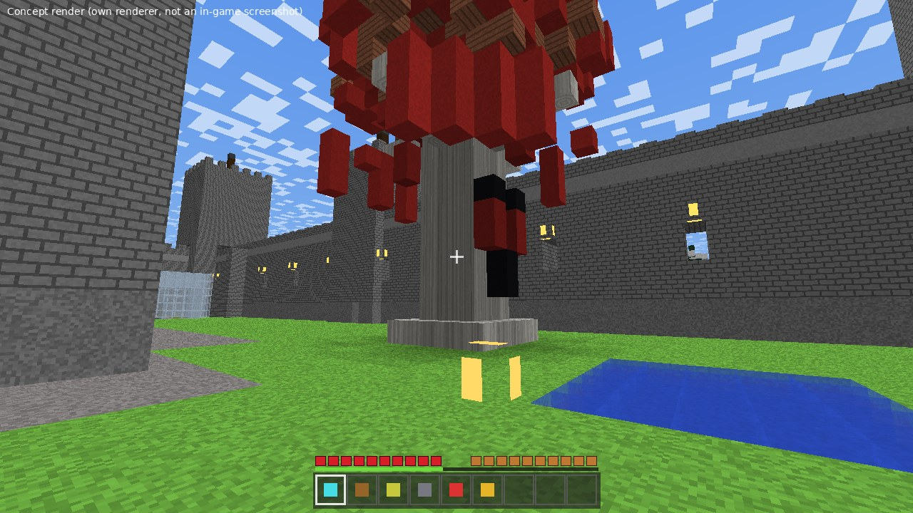 شجرة الـ Weirwood |
| 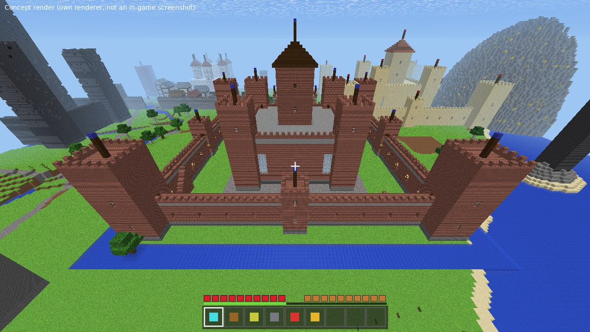 ريفررن بخندقها | 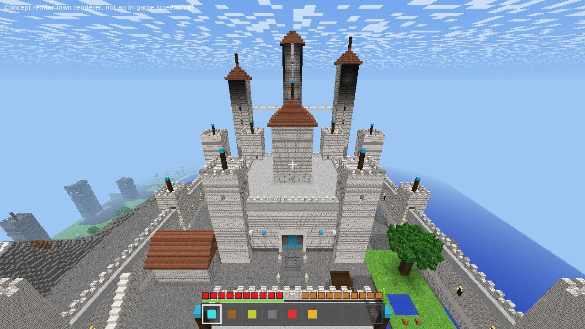 العش وأبراجه البيضاء |
| 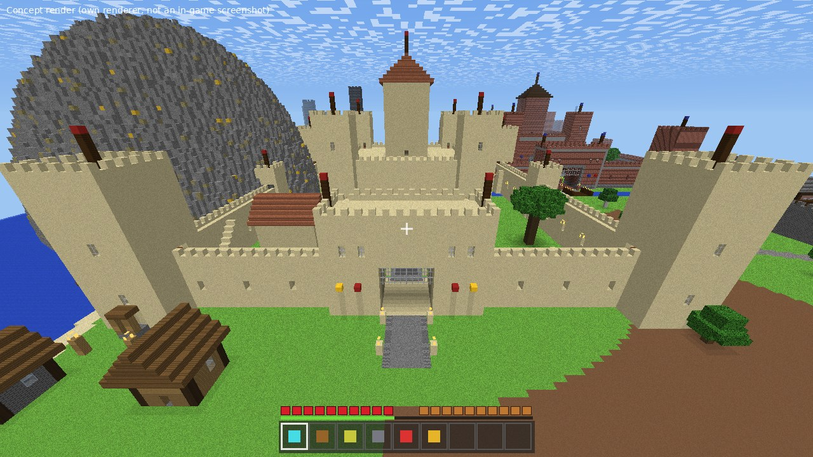 صخرة كاستلي | 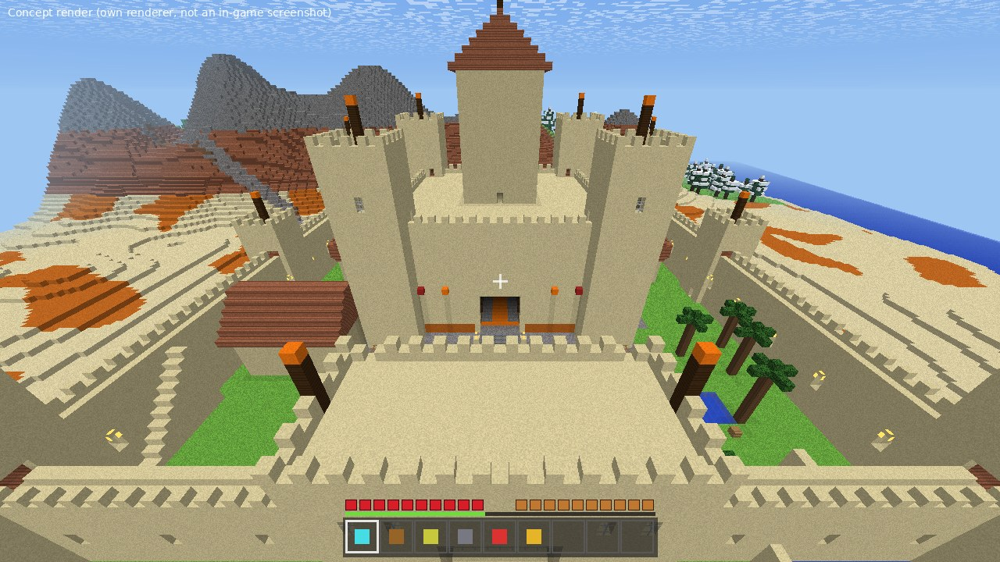 سنسبير |
| 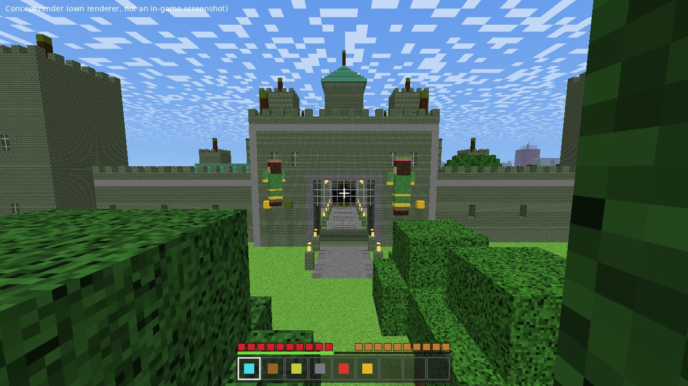 هايغاردن | 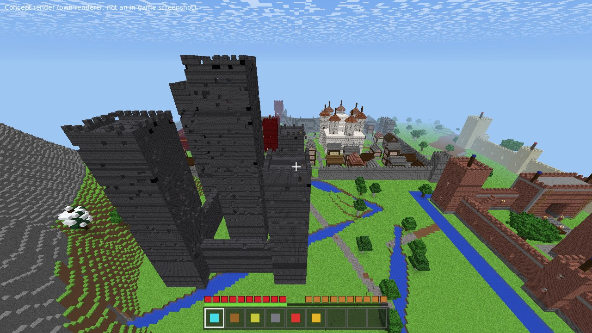 هارينهال |
| 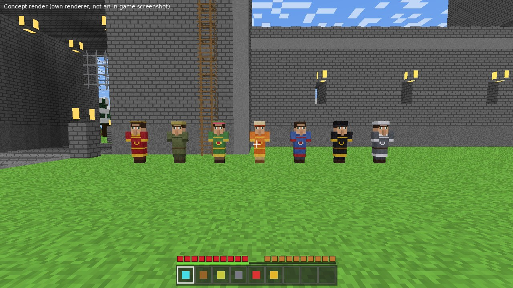 القرويون بلبس وستيروس | 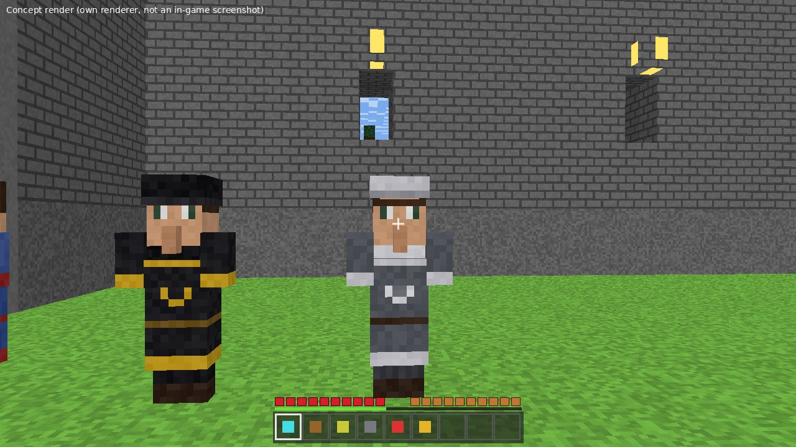 شمالي وحارس الجدار |

## التثبيت (CurseForge)
> **أهم شي:** كل بروفايل في CurseForge له مجلد خاص. لا تستخدم زر **Import** (هذا للـ modpacks فقط). انسخ الملفات يدويًا.

1. في CurseForge: **Create** ← اسم `Westeros` ← الإصدار **26.3** ← **Vanilla** ← **Create**.
   (للـ shaders انظر القسم التالي، واختر **Fabric** بدل Vanilla.)
2. اضغط يمين على البروفايل ← **Open Folder**.
3. فك ضغط `GoT_Westeros_Install.zip`، وانسخ مجلد **`GoT_Westeros`** داخل مجلد **`saves`**.
   لازم يصير المسار `saves\GoT_Westeros\level.dat`. (احذف أي نسخة قديمة أول.)
4. انسخ `GoT_Villagers_ResourcePack.zip` (بدون فك) داخل **`resourcepacks`**.
5. **Play** ← Singleplayer ← **حرب الممالك** ← اضغط **Make a Backup and Load** على أي تحذير (طبيعي).
6. في اللعبة: `T` ثم `/function got:selftest` يعطيك أسطر **[نجح]** أو **[فشل]**.

إذا العالم ما فتح ("فشل تحميل بيانات العالم") جرّب النسخة البديلة: أنشئ عالم **Superflat** عادي (Allow Cheats: ON)، أغلقه، ثم خذ محتويات
`GoT_Westeros_Fallback.zip` وضعها داخل مجلد العالم (تستبدل `region` وتضيف `datapacks` و`resources.zip`).

## رسومات أحلى (Shaders)
حتى تتحسن الرسومات بشكل كبير: أنشئ بروفايل **Fabric** بدل Vanilla (نفس الإصدار)، ثم **Add Content** وثبّت:
**Fabric API** + **Sodium** + **Iris Shaders**، ومن قسم Shaders: **Complementary Shaders - Reimagined**. بعدها في اللعبة:
*Options ← Video Settings ← Shader Packs*. (الخريطة والـ datapack يشتغلون على Fabric عادي. تأكد أن Iris يدعم إصدارك، وإلا خذ أحدث إصدار يدعمه.)

## طريقة اللعب
كل الأوامر تكتبها في الدردشة (`T`) وتشتغل حتى لغير الأدمن.

| الأمر | وظيفته |
|---|---|
| `/trigger got_house` | قائمة البيوت التسعة، ثم `/trigger got_house set 2` مثلًا |
| `/trigger got_start` | قائمة الحملة: `set 2` قصيرة (30 دقيقة) - `set 3` طويلة (55 دقيقة) - `set 4` إيقاف |
| `/trigger got_quest` | حالة الحرب: الوقت والشتاء والقلاع والهجوم القادم وذهبك |
| `/trigger got_go` | السفر بين القلاع والمعالم |
| `/trigger got_power` | قدرة بيتك (لها وقت تعافي) |
| `/trigger got_shop` | متجر الحرب: علاج، سهام، سيف، درع، حصان، حرس، تميمة |
| `/trigger got_scout` | **عين الغراب**: تشوف المعركة من الأعلى 30 ثانية |
| `/trigger got_accuse` | اتّهم القروي الواقف قربك (اقرأ "الوجه الخفي" تحت) |
| `/trigger got_kit` | عدّتك من جديد (`set 2` أجنحة وحصان) |
| `/trigger got_battle` | معركة تدريبية في القلعة اللي أنت فيها (خارج الحملة) |

### البيوت التسعة وقدراتها
| البيت | الميزة الدائمة | القدرة (`got_power`) |
|---|---|---|
| ستارك | لا يؤذيك الصقيع | عواء الذئب: سرعة وقوة لمن حولك |
| لانستر | ذهب أكثر 50٪ | الدَّين يُسدَّد: 3 حراس من حديد (30 ذهب) |
| تارجاريان | لا تحرقك النار | نار وتنين: نفخة نار تحرق الأعداء |
| مارتل | سرعة أعلى | لدغة الأفعى: تسمّم وتبطّئ الأعداء |
| تايريل | شبع وشفاء بطيء | ورد الشفاء: تشفي كل الحلفاء |
| باراثيون | قوة إضافية | الغضب: قوة ومناعة عالية |
| غريجوي | تنفس تحت الماء | المدّ والجزر: ترفع الأعداء في الهواء |
| أرين | سقوط بطيء | قفزة الصقر: قفزة عالية بهبوط هادئ |
| تولي | حظ أعلى | الفيضان: شفاء ودرع امتصاص |

### الحملة
* **الحملة القصيرة:** هجمات على القلعة السوداء ثم كينغز لاندينغ ثم صخرة كاستلي، ثم المعركة الأخيرة في وينترفيل.
* **الطويلة:** 7 قلاع ثم المعركة الأخيرة.
* اللاعبون يسافرون بـ`/trigger got_go` إلى القلعة المهددة. القلعة التي ما فيها أحد وقت الهجوم **تسقط**.
* إذا فشل الدفاع (7 وفيات) تسقط القلعة. تقدرون **تستردونها** بمعركة (`/trigger got_battle`) داخلها.
* **المعركة الأخيرة:** كل قلعة صامدة تعطيكم حارسين من حديد، وكل قلعة ساقطة تضيف أعداء لكل موجة.
* **الذهب** من كل موجة ومن الهدايا ومن كشف المتنكّر. **الرتب:** فارس ← لورد ← يد الملك ← حامي الممالك.

### الوجه الخفي (لغز مع القرويين)
في كل قلعة وقرية قروي واحد **متنكّر** (قاتل). كلّم القرويين (زر الفأرة الأيمن): المتنكّر يتحدث بغرابة وما يعرف شيئًا عن المكان.
لما تشك فيه قف قريبًا منه واكتب `/trigger got_accuse`. إذا أصبت ينكشف ويهاجمك، وتكسب ذهبًا ورتبة. وإذا أخطأت تخسر ذهبًا.

## القرويون والذكاء
* لبس القرويين من حزمة الموارد (فراء رمادي للشمال، أسود وذهبي لحرس الليل، قرمزي وذهبي للانستر...).
* كلامهم عربي، مختلف لكل بيت، ويتغير حسب حالة الحملة (الشتاء والقلاع).
* هذا **ذكاء مبرمج** (قواعد وعشوائية وذاكرة للحالة)، مو نموذج لغوي.
* **ذكاء اصطناعي حقيقي (اختياري):** مجلد `ai/` فيه "الغراب ثلاثي العيون" يرد على أسئلتك بالدردشة عبر Claude. يحتاج **سيرفر** (مو لعب فردي) و**مفتاح API** وله تكلفة. الشرح في `ai/README.md`.
  جرّبته بسيرفر ونموذج وهميين فقط، وما جربته على ماينكرافت ولا على Claude الحقيقي.

## وين تلقى الأشياء
| المكان | الأمر |
|---|---|
| مخزن الأسلحة | الفناء الغربي في كل قلعة (صناديق أسلحة ودروع) |
| سراديب وينترفيل | مدخلها غرب القلعة (سلالم للأسفل) |
| مناجم كاستلي | فم الأسد في الصخرة غرب قلعة كاستلي |
| الزجاج التنيني | كهف تحت دراغونستون |
| Nightfort | حصن مهدّم جنوب الجدار (غرب القلعة السوداء) |
| برج الفرح | جبال دورن الحمراء |

## ملاحظات صريحة
* بُني هذا كله بدون تشغيل ماينكرافت (بيئتي ما تدعمها)، فالخطأ ممكن. اللي تحققت منه: قراءة العالم بقارئ مستقل، فحص صياغة كل الأوامر بـ`mecha`، وأن كل أسماء البلوكات والعناصر موجودة حتى إصدار 26.1.
  إصدار 26.3 نفسه ما أقدر أفحصه. إذا صار خطأ صوّر الشاشة أو أرسل `logs\latest.log`.
* اللعبة تُطفئ ولادة المخلوقات الطبيعية (الحيوانات والوحوش) عمدًا، فالأعداء يظهرون فقط في المعارك.

## للمطورين
```
tools/world/   مولّد العالم (تضاريس، أقاليم، أنهار، طرق، أشجار، مدن، معالم، سراديب) + كاتب Anvil و level.dat
tools/castle.py قالب القلعة   tools/game.py المعارك والحملة والبيوت والمتجر   tools/ar.py النصوص العربية
tools/render/  مجسّم الصور   tools/villagers/ لبس القرويين   ai/ جسر الذكاء الاصطناعي   server/ سيرفر Docker
```
لإعادة البناء: `python3 tools/package.py` (يحتاج numpy وscipy وPillow).
