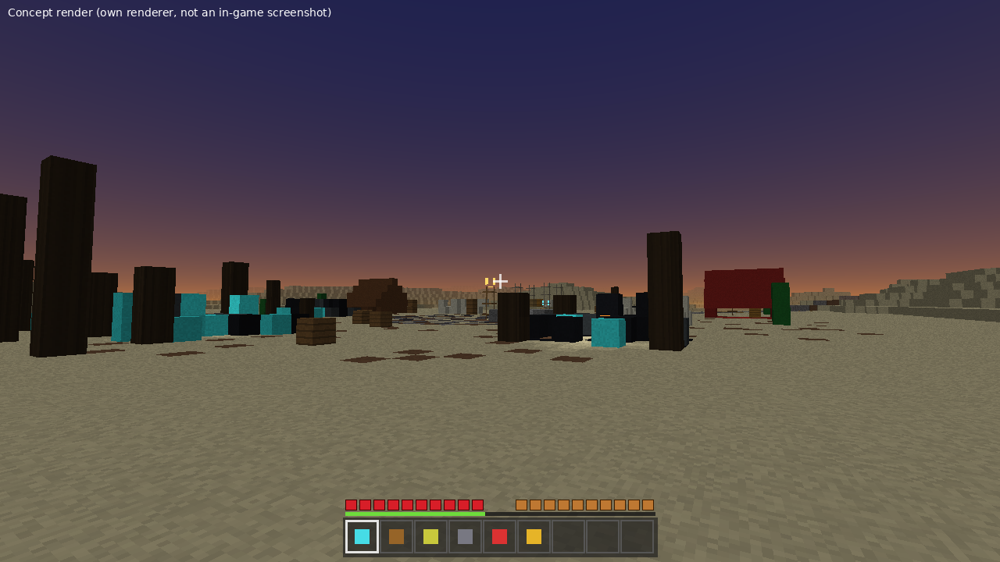
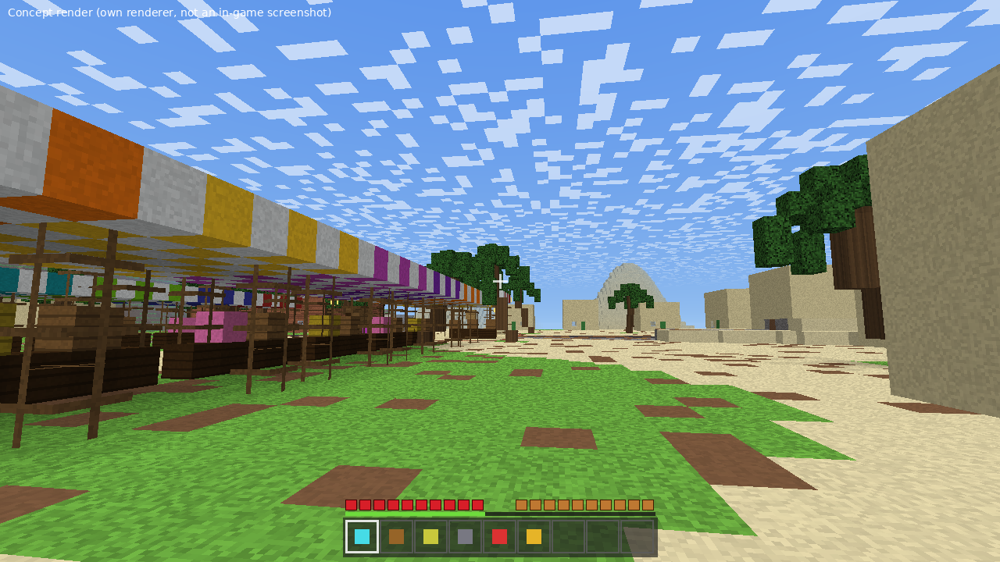
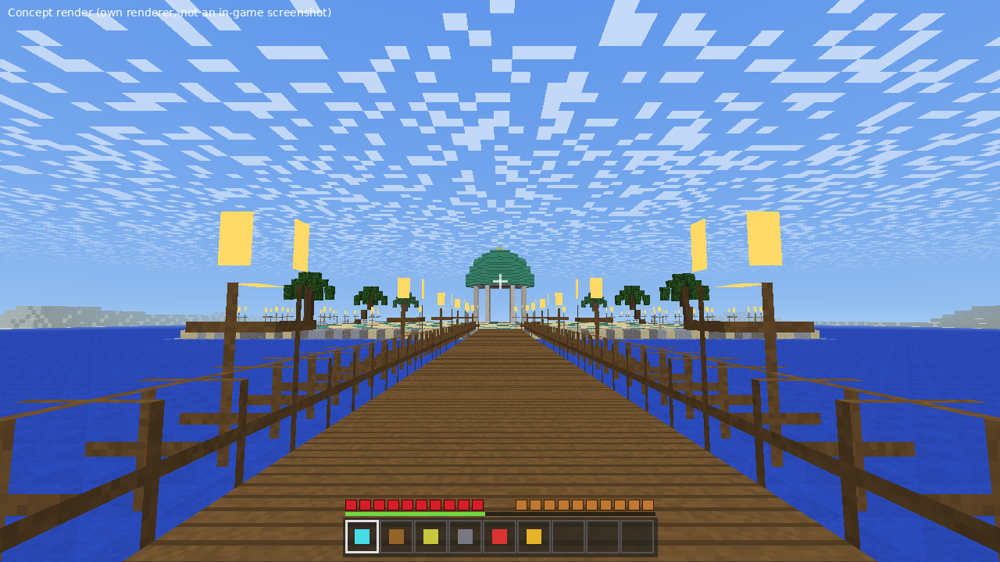
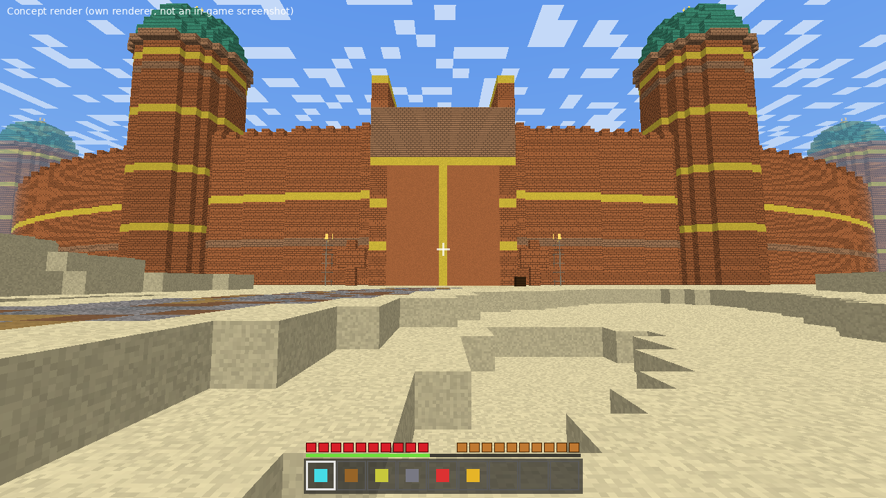
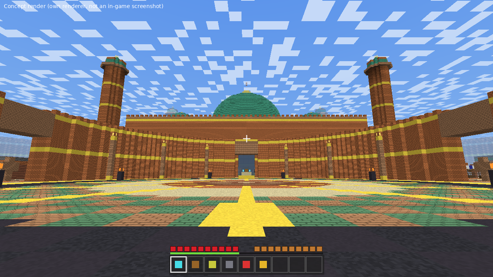
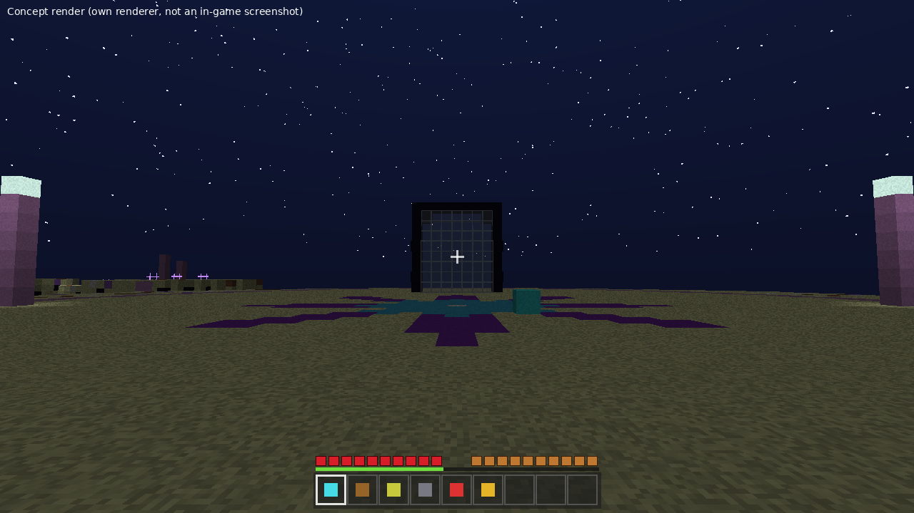

# مدينة النحاس: ليلة الفانوس

مغامرة تعاونية للأصدقاء والأطفال في ماينكرافت جافا **1.21.4**. أنتم قافلة صحراء استيقظت ليلًا ومعكم فانوس مسحور. مدينة النحاس نامت أهلها كتماثيل، ولازم تجمعون **7 أختام نحاسية** من 6 تجارب في أراضي واسعة وعالمين ثانيين (بحر النجوم وأرض الجمر)، ثم تفتحون البوابة وتهزمون **الحارس النحاسي**. الرعب خفيف (أجواء وقفزات مفاجئة) بدون دم. النصوص كلها عربية، وفيه وضع أطفال أسهل.

> الصور أدناه **رسومات تصوّرية** مولّدة من ملفات العالم، وليست لقطات من داخل اللعبة.

| | |
|---|---|
|  معسكر القافلة (تصوّر) |  واحة الدلال (تصوّر) |
|  المكتبة الغارقة (تصوّر) |  بوابة المدينة (تصوّر) |
|  ساحة القصر (تصوّر) |  بحر النجوم (تصوّر) |

## التثبيت في CurseForge (الطريقة الأساسية)
1. أنشئ **Profile** جديد: Minecraft **Vanilla 1.21.4**.
2. من الـ Profile اضغط الثلاث نقاط ثم **Open Folder**.
3. فك ضغط `dist/Nahas_City_World.zip` داخل مجلد **saves** (يصير عندك `saves/NahasCity/level.dat`).
4. شغّل اللعبة: Singleplayer ثم **NahasCity**. أول دخول يبدأ المقدمة تلقائيًا (التحميل الأول بطيء شوي، الإضاءة تنحسب مرة وحدة).

اختياري للجودة: **Fabric + Iris + Sodium** مع شيدر **Complementary** (ما نحتاجها للّعب، بس أحلى).
حزمة الموارد داخل العالم (`resources.zip`) وتُطبّق لحالها؛ إذا ما ظهرت الأيقونات المخصصة ركّبوا `Nahas_City_ResourcePack.zip` من قائمة Resource Packs.

## الطريقة البديلة (Fallback) إذا العالم ما فتح
1. أنشئ عالم جديد **Superflat** (Creative مو مهم) وسمّه أي اسم، ثم اخرج منه.
2. فك ضغط `Nahas_City_Fallback.zip` **داخل مجلد ذلك العالم** (فوق الملفات الموجودة).
3. ادخل العالم. إذا ما اشتغلت الحزمة اكتب: `/datapack enable "file/nahas_city"`.

## كيف تلعبون
تشغّلون كل شي بالأوامر (المساعدة تظهر لكم بأزرار قابلة للضغط في الدردشة). ابدأوا بـ `/trigger nh_help set 1`.

| الأمر | وظيفته |
|---|---|
| `/trigger nh_help set 1` | قائمة المساعدة (٢ وضع أطفال، ٣ إيقافه، ٤ شرح الأوامر، ٥ المهمة، ٦ العدّة، ٧ إنقاذ وعودة للواحة) |
| `/trigger nh_role set 1..4` | اختيار الدور: مستكشف، فارس، حكيم، ظل |
| `/trigger nh_power set 1` | قوة الدور (٢ = وميض الفانوس) |
| `/trigger nh_go set N` | سفر سريع للأماكن التي اكتشفتموها (`set 1` يعرض القائمة، ١٣ = الانتقال إلى صديق) |
| `/trigger nh_shop set 1` | السوق (تشترون بالذهب من واحة الدلال) |
| `/trigger nh_quest set 1` | المهام |
| `/trigger nh_map set 1` | الإسطرلاب، ٣ = قائمة الأماكن، ٤ = خريطة المدينة (تظهر عليها علامة مكانكم) |
| `/trigger nh_ask set 1` | اسأل الجني (تلميح؛ يحتاج جسر الذكاء الاصطناعي الاختياري) |
| `/trigger nh_start set 1` | إعادة عرض القصة |

## اختبار ذاتي داخل اللعبة
لازم تكون **operator** (أو العالم يسمح بالأوامر). اكتب `/function nahas:selftest` وتطلع لك نتائج [نجح]/[فشل] بالعربي.
بديل بدون مسار الدالة: `/tag @s add nh_admin` ثم `/trigger nh_help set 8`.

## ما تم التحقق منه وما لم يتم (بصراحة)
لم نشغّل ماينكرافت هنا. المتحقَّق منه: الأوامر تعدّي فحص `mecha` بدون أخطاء، أسماء البلوكات والعناصر موجودة في سجلات 1.21.4 و26.1، كل الدوال وجداول الغنائم والإنجازات المشار لها موجودة، ملفات JSON سليمة، وملفات المناطق (regions) تُقرأ من قارئ مستقل (222 فحص ناجح).
**غير متحقَّق منه:** فتح العالم فعليًا في 1.21.4، النسخة 26.3، الأبعاد المخصصة (بحر النجوم/أرض الجمر)، ظهور الخريطة، `text_display`، كاميرا المقدمة، وتطبيق `resources.zip` تلقائيًا. التفاصيل في [docs/UNVERIFIED.md](docs/UNVERIFIED.md).

## محتويات المجلد
`worldgen/` مولّد العالم، `datapack/` حزمة البيانات، `resourcepack/` حزمة الموارد، `ai/` جسر الجني (اختياري، `Nahas_City_AI_Bridge.zip`)، `dist/` الملفات الجاهزة، `build_dist.py` يعيد التجميع.
